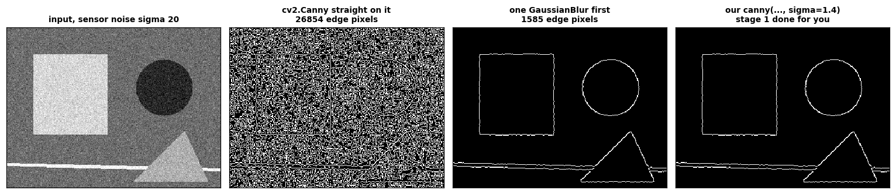

# cv01-pixels-to-edges

**An image is a grid of numbers. Everything else in computer vision is
arithmetic on that grid.** This repository takes that claim from "read a pixel
value" to "here is my own Canny edge detector, and here is the measured
agreement with OpenCV's", one testable step at a time.


It is written for two readers at once. If you have never treated an image as an
array, start at the top and every step is derived. If you have shipped vision
code for years, the details are where the value is: which border mode
`cv2.filter2D` actually defaults to, why Otsu's tie-break has to match OpenCV's
or every test fails, and why our Canny agrees with `cv2.Canny` on 99.98% of
pixels rather than 100%.

**Nothing here is asserted without being measured.** Every number below was
printed by a script in `examples/`, and the claims the code makes about itself
are checked by 116 tests.

---

## What you will understand by the end

- Why `250 + 10` is **4** in an image, why nothing raises, and where exactly the
  wrapping starts.
- Why a NumPy slice can corrupt an image three functions away, and why the
  dangerous default is the right one (measured: 3,043x cheaper).
- How to write 2-D convolution from scratch and prove it matches `cv2.filter2D`.
- Why a 3x3 blur on a *uniform* image returns 44.4 at the corners if you pad
  with zeros.
- Why a `K x K` Gaussian is really two 1-D passes, and what that is worth on
  this CPU (measured: 0.9x at K=3, 43x at K=63).
- How non-maximum suppression thins a five-pixel ridge to one pixel, and why
  comparing along the edge instead of across it returns an **empty image**.
- How to implement Otsu's criterion, and why one number can never threshold a
  page with a lamp on one side (IoU 0.31 global, 0.35 Otsu, 0.96 adaptive).

---

## The flow

```
  images.py                 a scene, generated from a seed
      |                     (no photographs committed; ground truth known)
      v
  [1] an array              shape, dtype, channel order, BGR vs RGB
      |
      v
  [2] the silent bugs       uint8 wrap  |  view vs copy
      |                     reproduce -> show the wrong output -> fix
      v
  [3] photometry            out = alpha * in + beta, wrong then right
      |
      v
  [4] colour                BGR --> gray --> HSV
      |                     a threshold that only HSV can win
      v
  [5] convolution           loops --> vectorised --> cv2.filter2D
      |                     border modes, kernel-sum rule, output size
      v
  [6] separability          rank 1 --> two 1-D passes --> measured speed-up
      |
      v
  [7] gradients             Sobel --> magnitude + direction
      |                       --> non-maximum suppression
      |                       --> double threshold --> hysteresis
      |                       --> our Canny vs cv2.Canny
      v
  [8] thresholding          global --> Otsu (implemented) --> adaptive
      |
      v
  a binary mask
```

Each stage only uses the ones above it. `edges` is built on `separable`, which
is built on `convolve`, which is built on nothing but NumPy.

---

## Quick start

```bash
pip install -r requirements.txt

python3 -m pytest -q                                  # 116 tests, ~5 s
PYTHONPATH=src python3 examples/07_edges.py           # or any of 01..08
```

Every example prints its narration to the terminal and writes its figure to
`docs/figures/`. They are numbered in teaching order and can be read as a
course.

---

## The stages, with the figures they produce

### 1. An image is an array


*Run on `images.tabletop_scene()`, a 360x480 BGR array. The middle panel of the
top row is `scene[100:108, 134:142, 2]` -- sixty-four `uint8` integers printed on
the shade each one produces, crossing the edge of the red disc. The bottom row
is the same scene as three separate grayscale images: a channel is a full 2-D
grid, not a property of a pixel.*

```
scene[105, 80] = [ 41  48 207]  <- [B, G, R], OpenCV's order
scene[268, 412]= [16 15 55]     same paint, in the shadow
pure blue  -> luma  29    pure green -> luma 150    pure red -> luma  76
                          (a plain mean would say 85 for all three)
```

### 2. The two bugs that are silent


*Top row, `images.gray_ramp()`: adding 60 in `uint8` makes the ramp climb to
white, reach 196, and fall off a cliff back to black. That is modulo 256 drawn.
Bottom row, the tabletop scene: the same bug touches 1.9% of the numbers, and
the red disc develops a teal wound where the R channel wrapped and B and G did
not. The last two panels write into a rectangle through a view and through a
copy.*

```
input      : [  0 100 190 194 195 196 240 255]
img + 60   : [ 60 160 250 254 255   0  44  59]   <- NumPy: modulo 256
saturating : [ 60 160 250 254 255 255 255 255]   <- clipped at 255

whole-image mean -- before  76.63 | buggy 131.76 | fixed 136.32
the specular alone -- before 103.37 | buggy  78.04 | fixed 157.16
```

The whole-image means differ by under five levels, so a summary check at the end
of a pipeline passes on a ruined image. Inspect a patch where the damage ought
to be worst, not the frame as a whole.

And `np.clip(img + 60, 0, 255)` does **not** repair it. The inner expression
runs first and has already wrapped, so `clip` is handed a 59 and a 59 is a
perfectly legal `uint8`; it passes straight through. It disagrees with the correct answer on exactly the 9,869 numbers that
wrapped.

For views: both crops read identically and `np.shares_memory` is the only thing
that tells them apart until you write. On a 4K frame, slicing as a view costs
0.23 us and copying costs 700 us -- **3,043x** -- which is why the dangerous
default is the right one, and why the rule is about intent: copy when you will
*write* and still need the original.

### 3. Brightness and contrast


*Every bug in this stage is one line on this plot. Left: what `uint8` does to a
+60 shift, with the cliff at 196. Right: contrast at alpha=1.6, three ways.*

```
alpha = 1.6  ->  pivot beta = 128 * (1 - alpha) = -76.8

    x |  pivoted |  no pivot |  convertScaleAbs
    5 |        0 |         8 |               69
   50 |        3 |        80 |                3
  128 |      128 |       205 |              128
  200 |      243 |       255 |              243
```

Mid-grey not moving is the signature of a correct contrast control. And
`cv2.convertScaleAbs` turned 5 into 69, because it computes
`|alpha*x + beta|` -- the pixel reflected off zero instead of stopping there. It
is wrong for every input below 48 here, which is 23.2% of the image, and right
everywhere else, so the damage is confined to the shadows.

### 4. Colour spaces, and a threshold only HSV can win


*The scene has two red discs of identical paint, one under the lamp and one in
the shadow, on a warm brown surface that is itself reddish. Bottom row: the
ground truth, a BGR rule tuned by eye on the lit disc, the best BGR rule that
exists, and the best hue rule.*

```
               B     G     R   |    H     S     V
lit           51    59   213   |    1   196   213
shadow        21    19    59   |  176   177    59
lit / shadow per channel: B 2.45x  G 3.10x  R 3.61x

best BGR box   R>= 68, G<= 51, B<= 59      -> IoU 0.5746
best hue wedge |H-0|<=7, S>=88, V>=25      -> IoU 0.9994
```

Both rules have three free parameters and both were searched exhaustively
against the same ground truth, so what is being compared is the colour space
and not how hard somebody tried. The BGR result is not a badly chosen
threshold -- it is the best axis-aligned box in BGR that exists for this image,
and the reason it cannot do better is arithmetic: once the illumination ratio
across an object exceeds about 2.9, admitting the shadowed sample necessarily
admits lit background. That derivation is in
[docs/WALKTHROUGH.md](docs/WALKTHROUGH.md#stage-4--colour-spaces-and-a-threshold-only-hsv-can-win).

The stage also lands the seam: the lit disc's median hue is **1** and the
shadowed one's is **179**. Plain subtraction says 178; they are 2 apart, and
both are red.

### 5. Convolution from scratch


*Top row on `images.shapes_gray()`: the input, a box blur, a sharpen, and the
Laplacian's edge map. Bottom row: the same 15x15 blur with zero padding and
with mirrored padding, their difference, and an emboss -- the asymmetric kernel
where the correlation/convolution flip is visible at all.*

```
kernel          loops vs vectorised    vectorised vs cv2
box 3x3                   5.684e-14            5.684e-14
laplacian                 0.000e+00            0.000e+00
sharpen                   0.000e+00            0.000e+00
emboss                    0.000e+00            0.000e+00

on this 240x320 image: loops 231.7 ms, vectorised 2.07 ms  (112x)
```

Three implementations of one operation, and the tests assert they agree for
eight kernels at three strides and for every border mode against its OpenCV
counterpart. The loop version is not slow because of the multiplies -- 700k
multiply-adds is microseconds of arithmetic -- but because the interpreter takes
76,800 round trips to schedule them nine at a time.

```
border         corner     edge   centre
constant         44.4     66.7    100.0
reflect101      100.0    100.0    100.0
cv2.blur        100.0    100.0    100.0
```

Every input pixel was 100. Blurring an image with no variation must return it
unchanged, and zero padding returns 44.4 at the corners because 5 of the 9
window cells are invented black.

And the kernel-sum rule, measured:

```
kernel         sum   out mean   out min   out max
(original)       -     128.75      40.0     250.0
box 3x3          1     128.75      40.0     250.0
laplacian        0       0.00    -333.0     297.0
sharpen          1     128.75    -235.0     547.0
```

Sum 1 preserves the mean exactly. Sum 0 drives it to zero. And both the
Laplacian and the sharpen leave `0..255` in both directions, which is why every
filter in this repository casts to float on its first line.

### 6. Separable kernels


*Left: `K*K / 2K` against the clock. Right: the same timings on a log scale, so
the `K^2` curve and the `K` curve are visible as different shapes.*

```
  k  mults 2D  mults sep  predicted   2D (ms)  sep (ms)  measured   max diff
  3         9          6       1.5x       4.0      4.56     0.88x    1.1e-13
  7        49         14       3.5x      18.0      6.90     2.61x    1.7e-13
 15       225         30       7.5x      95.5     12.45     7.67x    3.4e-13
 31       961         62      15.5x     423.5     20.12    21.05x    6.5e-13
 63      3969        126      31.5x    1951.7     45.11    43.26x    1.2e-12
```

*That table is one run. Repeating it on the same (shared, loaded) machine gives
`measured` values between 0.88x and 1.26x at k=3, and between 31x and 46x at
k=63, against a `max diff` column that does not move at all. Which columns are
facts and which are weather is the point of the paragraph below.*

Two claims that must not be blurred together. **`max diff` is exact**:
separability is a factorisation, not an approximation, and anything above
floating-point dust there is a bug. **`measured` is a wall-clock timing on one
shared CPU and it wobbles** -- at `k = 3` it lands either side of 1, because
saving three multiplies is swamped by the fixed cost of each array operation,
and by `k = 63` the measured ratio *overtakes* the prediction because the 2-D
pass also touches `K^2` times as much memory. Re-running this on your own
machine will give different digits; what survives is "same order of magnitude,
rising with K".

A kernel factors exactly when its rank is 1, which is testable rather than a
judgement call. Sobel-x is rank 1 and factors into `[1,2,1]` and `[-1,0,1]`: the
2 in its middle row is literally a smoothing pass glued to a differencing pass.
The Laplacian is rank 2, and `separate()` raises rather than returning a silent
approximation.

### 7. Gradients, non-maximum suppression, hysteresis, Canny


*Left to right, top row: the input, the two signed Sobel components on a
diverging colour map, and the gradient magnitude. Bottom row: gradient
direction as hue with strength as value, the magnitude after non-maximum
suppression (one pixel wide), our Canny at thresholds 50/150, and every pixel
where it disagrees with `cv2.Canny`.*

```
image                     ours     cv2  differ  agreement
shapes                    1618    1612      14    99.982%
shapes, pre-blurred       1591    1580      19    99.975%
checkerboard              3234    3164     126    99.781%
diagonal ramp              297     299       2    99.992%
pure noise                9245    9491     444    98.266%
```

**Our Sobel is bit-identical to `cv2.Sobel`** -- `np.array_equal`, not
`allclose` -- because `correlate2d` defaults to the same `BORDER_REFLECT_101`.
The Canny disagreement is not a defect and it is not noise. OpenCV computes
magnitudes in 16-bit integers and we computed them in float64, so wherever two
neighbouring magnitudes are exactly equal the two implementations break the tie
differently and the crest lands one pixel over. Both are right: a ridge that is
genuinely flat has no single crest.

Read the ordering. The single smooth diagonal is best (99.992%) -- one
unambiguous ridge, no ties. Pure noise is worst (98.27%) -- nearly every pair of
neighbours is a near-tie. The checkerboard sits between them *despite* having
the sharpest edges in the set, because its right-angle corners are exactly where
the four direction bins are ambiguous.

And the thinning step, on the standard ramp drill:

```
image row       : [ 10  10  40  90 140 150 150]
magnitude row   : [  0 120 320 400 240  40   0]

compare ACROSS the edge (correct): [  0   0   0 400   0   0   0]  -> 3 pixels kept
compare ALONG  the edge (bug)    : [0 0 0 0 0 0 0]                -> 0 pixels kept
```

Every row of that image is identical, so along the edge every pixel ties with
its neighbours, nothing is ever strictly largest, and the map comes back empty.
Stepping along the ridge does not narrow it. It wipes it out.



*`cv2.Canny` runs stages 2 to 5 and leaves stage 1 to the caller. That is not a
cosmetic omission: at a sensor noise of sigma 20 it is the difference between
about 1,585 edge pixels and 26,854.*

### 8. Thresholding


*The ink is drawn, so the ground truth is exact and every mask can be scored.
The top-right panel plots the mean value per column for paper and for ink: no
horizontal line can sit above all the ink and below all the paper, which is the
entire argument for a per-pixel threshold.*

```
method              IoU  ink found, left  ink found, right
global T=127      0.307            21.2%             98.4%
otsu T=109        0.351            19.2%             85.3%
adaptive 31/10    0.958            20.8%             17.6%
(truth)           1.000            19.2%             17.5%
```

The global threshold claims 98% of the right half is ink, because the shadowed
paper has fallen below 127. Otsu improves on that and is still wrong, for the
same structural reason: one number has to serve the entire frame.


*Otsu in one picture: score every threshold, take the peak. The left plot is why
that peak is not good enough here -- the lamp has smeared the paper across the
whole range, so there is no valley to find.*

Our Otsu returns **exactly** what `cv2.threshold(..., THRESH_OTSU)` returns on
all eight test images, tie-break included, and the identity
`sigma_total^2 = sigma_within^2 + sigma_between^2` is checked at 37 thresholds on
each of them.

---

## Why it is built this way

Full records with alternatives and costs are in
[docs/DECISIONS.md](docs/DECISIONS.md). The four that shape everything else:

**Correlation is the primitive; convolution is the wrapper.** Everything a
reader will meet -- `cv2.filter2D`, `scipy.ndimage.correlate`, every conv layer
in every framework -- does cross-correlation. Making the mathematically-named
operation the default would put our Sobel at the opposite sign from OpenCV's and
spend the reader's attention on our naming. Cost: `convolve.py` is mildly
misnamed, and a reader from a DSP background needs one paragraph.

**Three implementations of convolution are kept, not one.** The loop version is
where the index bookkeeping is visible; the vectorised version is what the rest
of the package can afford to call; the library version is the check. The
agreement between them, asserted in a test, is what turns "I understand
convolution" into something checkable. Cost: about 40 extra lines and a slower
test suite.

**float64 through the pipeline, `uint8` only at the boundary.** The Laplacian on
our own test image runs from -333 to +297. In `uint8` both ends clip silently
and what you lose is always the same half of your edges. Cost: eight bytes per
pixel instead of one. For a real-time pipeline that is the wrong trade and
`float32` is right; this repo is optimised for being checkable.

**Every test image is generated; none is committed.** A number quoted in this
README has to be re-derivable, and a committed JPEG can be resized or replaced
until it silently is not. Generation also buys ground truth -- examples 04 and 08
can quote an IoU only because we drew the objects. Cost: it is the biggest
limitation this repo has, and it gets its own section below.

---

## Limitations, honestly

**The scenes are synthetic, and synthetic is easier.** The hue-thresholding
result in stage 4 -- IoU 0.9994 -- is higher than any real photograph would give,
because the discs have exactly one reflectance and the only thing changing
across the frame is the illumination, which is precisely the case hue is
invariant to. Real surfaces have inter-reflections, a coloured bounce and sensor
noise that all move hue too. The example says so in its own output. **What
transfers is the ranking and its mechanism, not the digit.**

**The timings are one run on one shared machine.** The correctness columns
(`max diff`, the agreement percentages, the exact Sobel match) are deterministic
and will reproduce anywhere. The millisecond columns will not. The loop-versus-
vectorised ratio in stage 5 has been observed anywhere between 29x and 112x on
this same box depending on what else was running, the separable speed-up at
`k = 3` between 0.88x and 1.26x, and at `k = 63` between 31x and 46x. Where a timing is quoted, the reasoning around it is written to survive
the number changing.

**The threshold-rule comparison is bounded to a family.** Stage 4 searches
axis-aligned BGR boxes with three parameters and hue wedges with three
parameters. A general six-parameter box, or a linear discriminant, or a small
classifier, would beat 0.575 in BGR. The claim is about the family of rules a
person actually writes by hand.

**Our Canny is not bit-identical to OpenCV's**, and stage 7 explains why rather
than fixing it. The tests assert an agreement floor (99.5% clean, 97.5% on
noise), which means they cannot catch a regression that moves fewer than 0.5% of
edge pixels. The NMS, hysteresis and Sobel outputs are pinned exactly by other
tests to cover that gap.

**This is single-scale, single-channel, CPU-only classical processing.** No
feature descriptors, no matching, no geometry, no learning. Edges are where this
stops.

---

## Repository layout

```
src/pixels/
  images.py       every test image, generated from a seed
  dtypes.py       the uint8 wrap and the view/copy mutation, reproduced
  photometry.py   alpha * in + beta, three wrong ways and one right one
  colour.py       BGR/gray/HSV by hand, and the exhaustive rule searches
  convolve.py     correlation in loops and vectorised, borders, output size
  separable.py    rank-1 factorisation, 1-D passes, the benchmark
  edges.py        Sobel, magnitude, direction, NMS, hysteresis, Canny
  threshold.py    histogram, Otsu's criterion, global and adaptive
  figures.py      matplotlib helpers (not imported by the package)

examples/         01..08, numbered in teaching order, each saves a figure
tests/            116 tests: every teaching claim above, asserted
docs/
  WALKTHROUGH.md  the long version: each stage, the code, the output
  DECISIONS.md    twelve architectural records with alternatives and costs
  figures/        the thirteen figures the examples produce
```

## Running everything

```bash
python3 -m pytest -q                          # 116 tests
for f in examples/*.py; do PYTHONPATH=src python3 "$f"; done
```

CI runs both on Python 3.10, 3.11 and 3.12. The examples are in CI on purpose:
every number in this README comes out of one of them, so a change that breaks a
figure fails the build instead of being noticed later.

## License

MIT. See [LICENSE](LICENSE).
