# Walkthrough

The whole pipeline, stage by stage, with the code that does it and the output
it produces. Every block of printed output below was pasted from a run of the
numbered example beside it; nothing here is illustrative.

Run along:

```bash
pip install -r requirements.txt
PYTHONPATH=src python3 examples/01_image_is_an_array.py    # ...and 02 through 08
```

---

## Stage 0 — the scene we will be working on

Everything is generated from a seed by `src/pixels/images.py`. There are no
photographs in this repository, which is a deliberate trade recorded in
[DECISIONS.md](DECISIONS.md#5-every-test-image-is-generated-none-is-committed):
it costs realism and buys reproducibility and ground truth.

The main scene is a tabletop -- four discs on a wooden surface, a lamp at the
left edge, deep shadow at the right. Three of its features are load-bearing
rather than decorative, and each one exists because a later stage needs it:

```python
# A specular highlight, so the brightest pixels really do reach ~255.
spec = cv2.GaussianBlur(spec, (0, 0), 4.0)
spec /= spec.max()
img += (150.0 * spec)[:, :, None]

# A lamp that also has a COLOUR temperature: warm on the left, cooler in the
# bounced light on the right.
lamp = np.linspace(1.35, 0.22, w, dtype=np.float32)[None, :]
tint = np.stack([np.linspace(0.86, 1.20, w, dtype=np.float32),   # B
                 np.ones(w, np.float32),                          # G
                 np.linspace(1.12, 0.88, w, dtype=np.float32)],   # R
                axis=-1)[None, :, :]
img *= lamp[:, :, None] * _vignette(h, w)[:, :, None] * tint
```

- The **specular** exists because without it nothing in the frame is bright
  enough for stage 2's `uint8` overflow to overflow.
- The **two red discs**, one lit and one shadowed, exist because a single red
  object under even light is a toy problem for stage 4.
- The **colour temperature ramp** exists because without it hue is *exactly*
  constant and the HSV result is a suspiciously perfect 1.000. With it, hue
  drifts a little, which is the honest claim: hue is more stable than B, G and
  R, not immune.

---

## Stage 1 — an image is an array

`examples/01_image_is_an_array.py`

The claim is that the picture *is* the numbers, so the first image is one where
you can predict every pixel: column `c` holds the value `c`.

```
    {'shape': (100, 256), 'dtype': 'uint8', 'size': 25600, 'itemsize': 1, 'nbytes': 25600}
    ramp[0, 0]   = 0   (top-left, black)
    ramp[50, 200]= 200   column 200 holds the value 200
    ramp[99, 255]= 255   (bottom-right, white)
```

Then the same three questions of a photograph, and the fact that trips
everybody: OpenCV stores **B, G, R**, not R, G, B.

```
    scene[105, 80] = [ 41  48 207]  <- [B, G, R], OpenCV's order
      so this pixel is R=207 G=48 B=41: strongly red, on the lit disc
    scene[268, 412]= [16 15 55]  same paint, in the shadow: R=55 G=15 B=16
```

Those two pixels are the same paint under different light, and all three of
their numbers fell together. Hold on to that; it is the whole of stage 4.

A **channel is a whole 2-D layer** rather than an attribute belonging to a
pixel. Lift one out on its own and what you have is an ordinary grayscale
image:

```
    scene[:, :, 0] -> shape (360, 480), mean  51.76  (B)
    scene[:, :, 1] -> shape (360, 480), mean  73.94  (G)
    scene[:, :, 2] -> shape (360, 480), mean 104.18  (R)
```

And grayscale is a weighted sum, not an average. `src/pixels/colour.py`:

```python
BT601_WEIGHTS = (0.114, 0.587, 0.299)   # B, G, R
```

```
    pure blue   BGR(255, 0, 0) -> luma  29 (a plain mean would say 85 for all three)
    pure green  BGR(0, 255, 0) -> luma 150 (a plain mean would say 85 for all three)
    pure red    BGR(0, 0, 255) -> luma  76 (a plain mean would say 85 for all three)
```

A plain mean maps all three to 85 and deletes the only thing that distinguished
them. "Convert to grayscale" is a lossy, opinionated step.

Finally, `size` counts numbers and `nbytes` counts bytes, and they coincide only
for `uint8`:

```
    scene as uint8   :   518,400 numbers     518,400 bytes
    scene as float32 :   518,400 numbers   2,073,600 bytes  (4x)
    one 1080p frame  : 6,220,800 bytes = 6.22 MB uint8, 24.9 MB float32
    at 30 fps that is 186.6 MB/s of memory traffic, whatever the file on disk says
```

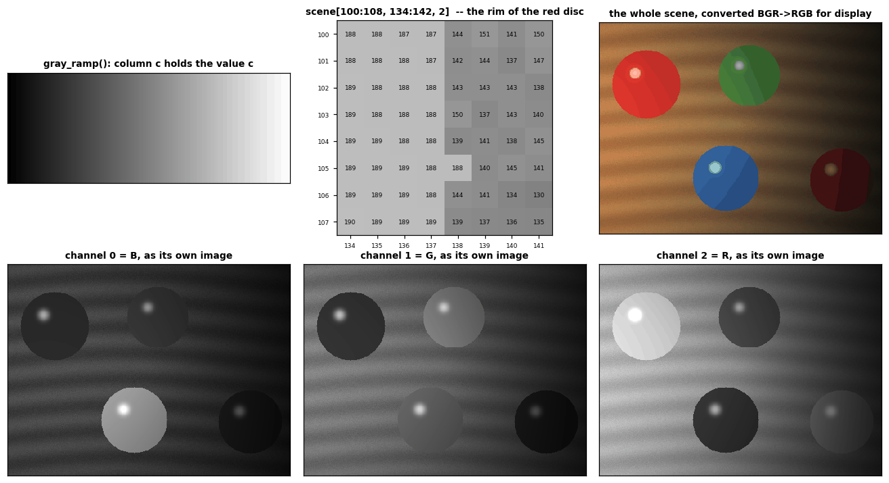

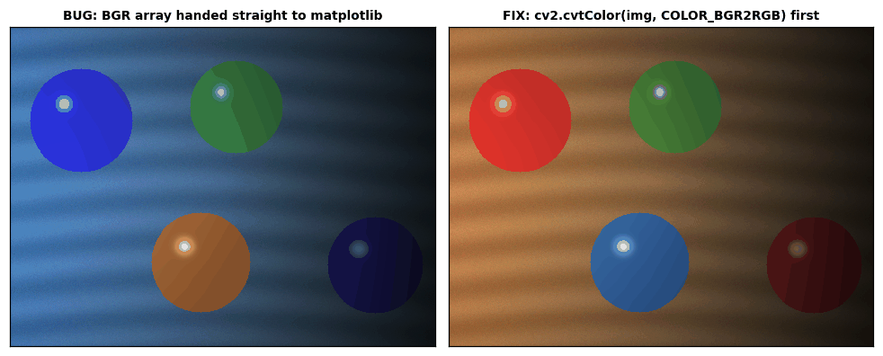

The second figure is the ordering bug on its own. The left panel hands OpenCV's
BGR array straight to matplotlib, which reads it as RGB; the red discs come out
blue. Same array, same shape, same dtype, every value in range, and no
exception anywhere -- which is the shape of nearly every colour bug you will
meet.

The middle panel of the first figure is the moment the abstraction stops being abstract: sixty-four
`uint8` integers, written on the shade each one produces, straddling the rim of
the red disc. The bottom row is the same scene as three separate grayscale
images -- the disc that is bright in R is dark in B and G, which is what "red"
means numerically.

---

## Stage 2 — the two bugs that never raise

`examples/02_silent_bugs.py`

This is the emotional centre of the project. A crash is a gift: it hands you a
traceback and a line number. These two hand you a plausible-looking image.

### Bug 1: `uint8` counts round like a clock

```
    input      : [  0 100 190 194 195 196 240 255]
    img + 60   : [ 60 160 250 254 255   0  44  59]   <- NumPy: modulo 256
    saturating : [ 60 160 250 254 255 255 255 255]   <- clipped at 255

    195 + 60 = 255 is the last honest answer.
    196 + 60 = 256, and 256 mod 256 is 0.
```

`src/pixels/dtypes.py` states that cliff as a function so a test can assert it:

```python
def wrap_threshold(delta: int) -> int:
    if delta <= 0:
        return 256
    return max(0, 256 - int(delta))
```

and `tests/test_dtypes.py` checks, for six values of `delta`, that below the
cliff the naive add is simply correct and at or above it every single value has
gone round -- which also means the wrapped result is *smaller* than its input.
That is the guard any pipeline can afford: **no honest brightening can make a
pixel darker.**

On the ramp the damage is arithmetic: 60 of 256 levels wrap, so 23.4% of the
image, and the prediction and the measurement agree exactly.

```
    on gray_ramp(): 6,000 of 25,600 pixels wrap (23.4%), predicted 23.4%
    on the photograph: 9,869 of 518,400 numbers (1.90%) wrap
    by channel [B, G, R]: [291, 93, 9485]
```

The photograph is the dangerous case, and here is why:

```
    whole-image mean -- before  76.63 | buggy 131.76 | fixed 136.32
    the specular alone -- before 103.37 | buggy  78.04 | fixed 157.16
```

The whole-image means differ by under five levels. A summary statistic checked at the
end of a pipeline passes on a ruined image, because most pixels went *up* by 60
and the few that wrapped went *down* by 196, and the effects nearly cancel.
Inspect a patch where the damage ought to be worst, not the frame as a whole.

And the fix that is not a fix:

```python
def brighten_clip_too_late(img, beta):
    return np.clip(img + np.full_like(img, np.uint8(beta % 256)), 0, 255)
```

```
      np.clip(img + 60, 0, 255) disagrees with the correct answer on
      9,869 numbers -- exactly the ones that wrapped.
```

Python evaluates the inner expression first. By the time `np.clip` runs, 255
has already become 59, and clipping 59 into `[0, 255]` leaves 59. `np.clip`
cannot undo a wrap because it cannot tell one happened: the wrapped value is a
perfectly legal `uint8`. **Widen the type before the arithmetic, not after.**

### Bug 2: a slice is a window, not a photocopy

```
    photo           = [10 20 30 40 50 60 70 80]
    photo[2:5]      = [30 40 50]   (a view)
    photo[2:5].copy() = [30 40 50] (a copy)
    Identical values. Nothing distinguishes them until you write.

    np.shares_memory(photo, view) = True
    np.shares_memory(photo, copy) = False
    after copy[:] = 0 -> photo = [10 20 30 40 50 60 70 80]   survived
    after view[:] = 0 -> photo = [10 20  0  0  0 60 70 80]   damaged
```

Both crops ended up `[0 0 0]`. The entire difference is what happened to
`photo`, and the line that damaged it never mentions it -- `view[:] = 0` is the
same instruction as `photo[2:5] = 0`, spelled so that the victim's name does not
appear.

Why NumPy chose the dangerous default, measured on this machine:

```
    one 4K frame is 24.9 MB. Cropping a 1000x1600 region:
      as a view :     0.23 us
      with copy :   700.15 us   (3,043x slower, 4.8 MB moved)
```

So the default is right and the rule is about *intent*, not about safety:

> Copy when the crop is going to be **written into** and the array it came
> from still matters. Do not copy to look: a read-only view costs nothing, and
> defensively duplicating one would spend megabytes to buy nothing.

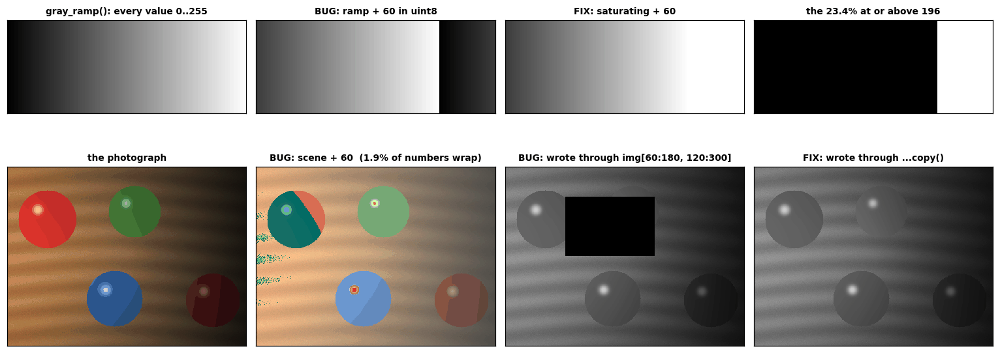

Panel 2 is modulo 256 drawn: the ramp climbs to white, reaches 196, and falls
off a cliff back to black. Panel 6 is the same bug on the photograph, where it
costs under two percent of the numbers -- and the red disc develops a teal wound,
because the R channel wrapped while B and G did not.

---

## Stage 3 — brightness and contrast

`examples/03_brightness_contrast.py`

Both knobs are one line: `out = alpha * in + beta`. `beta` shifts (brightness),
`alpha` scales (contrast).

Scaling is about *zero*, so `alpha` on its own brightens as well as spreads --
nothing gets darker, which is not what "more contrast" means. Pivoting about
mid-grey fixes it, and costs no new machinery:

```python
def pivot_beta(alpha: float, pivot: float = 128.0) -> float:
    return float(pivot * (1.0 - alpha))
```

because `alpha*(x - 128) + 128` rearranges to `alpha*x + 128*(1 - alpha)`.

```
    alpha = 1.6  ->  pivot beta = 128 * (1 - alpha) = -76.8

        x |  pivoted |  no pivot |  convertScaleAbs
    ------------------------------------------------
        5 |        0 |         8 |               69
       50 |        3 |        80 |                3
      128 |      128 |       205 |              128
      200 |      243 |       255 |              243
```

Read the `x = 128` row: mid-grey does not move under the pivot. That is the
signature of a correct contrast control, and `tests/test_photometry.py` asserts
it at five values of alpha.

Read the `x = 5` row: `cv2.convertScaleAbs` turned 5 into 69. It computes
`saturate_cast<uchar>(|alpha*x + beta|)` -- the pixel *reflected off* zero
instead of stopping there. We can name exactly where that starts:

```python
def convert_scale_abs_reflects_below(alpha, beta):
    if alpha <= 0 or beta >= 0:
        return 0.0
    return float(-beta / alpha)
```

```
    convertScaleAbs is wrong for every x below 48, which on this
    image is 40,074 of 172,800 pixels (23.2%).
```

It agrees with the correct answer everywhere else, so the bug appears only in
the shadows -- where you look least. `convertScaleAbs` is safe exactly when
`beta >= 0`, and pivoted contrast makes `beta` negative by construction. Its
legitimate job is displaying a signed gradient, where the absolute value is the
feature you wanted.

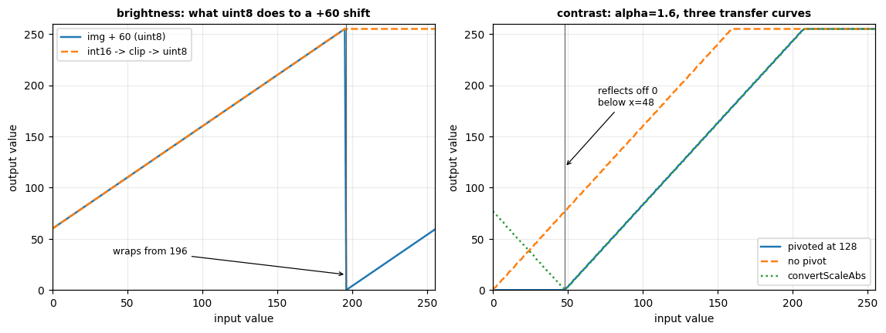

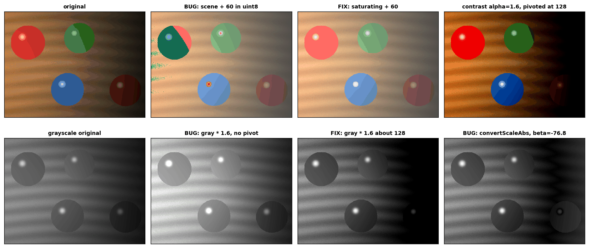

Every bug in this stage is one line on the first figure: the cliff at 196 where the
wrap begins, the curve that never goes below its input, and the V where
`convertScaleAbs` bounces off zero.

---

## Stage 4 — colour spaces, and a threshold only HSV can win

`examples/04_colour_spaces.py`

First, the conversion written out longhand and checked:

```
    H: identical on  99.86% of pixels, never off by more than 1
    S: identical on  98.83% of pixels, never off by more than 1
    V: identical on 100.00% of pixels, never off by more than 0
```

The remainder is rounding -- OpenCV runs a fixed-point integer path and we ran
float64. V matches exactly because V is just the largest channel and there is
nothing to round.

Now the mechanism. The same paint, lit and shadowed:

```
                   B     G     R   |    H     S     V
    lit           51    59   213   |    1   196   213
    shadow        21    19    59   |  176   177    59
    lit / shadow per channel: B 2.45x  G 3.10x  R 3.61x
```

Light is **multiplicative**: illumination slides a colour along a ray through
the origin of BGR space. Hue is the angle of that ray, V is the distance along
it. So V collapses by a factor of 3.6 and hue moves by 2 out of 180.

### The seam

```
    median hue, lit disc    : 1
    median hue, shadow disc : 179
    plain subtraction says they are 178 apart.
    They are 2 apart
```

Hue is an angle, OpenCV stores it 0..179 (the wheel halved to fit a byte), and
179 and 0 are neighbours. Red is the one hue that sits *on* the seam. This is
why every tutorial detects red with two `inRange` calls -- or, as here, with one
circular distance:

```python
def hue_distance(hue, centre):
    d = np.abs(hue.astype(np.int16) - int(centre))
    return np.minimum(d, 180 - d)
```

```
    a hue window using plain |H - 1| <= 7 : IoU 0.564
      -- it finds the lit disc and misses the shadowed one completely
```

### The comparison

Both colour spaces get a three-parameter rule family and an exhaustive sweep,
so what is being measured is the space and not the tuning.

```
    best BGR box   R>= 68, G<= 51, B<= 59        -> IoU 0.5746
    best hue wedge |H-0|<=7, S>=88, V>=25   -> IoU 0.9994

    And the rule you would have written by eye, tuned on the lit disc
    (R>=150, G<=90, B<=90): IoU 0.518
      it recovers  96.7% of the lit disc
      and           0.0% of the shadowed one.
```

Why the BGR box *cannot* win, in arithmetic. Write the object's colour as
`(205, 52, 48)` in R, G, B and the wood's as `(165, 122, 78)`, both scaled by
whatever illumination `L` falls on them. The box must admit the object at its
darkest, so `R_lo <= 205*L1`; and at its brightest, so `G_hi >= 52*L2`. A wood
pixel at illumination `L` gets in when `165L >= R_lo` and `122L <= G_hi`.
Substituting the tightest legal bounds, wood leaks whenever

```
    1.24 * L1  <=  L  <=  0.426 * L2
```

which is a non-empty range exactly when `L2 / L1 >= 2.92`. The scene's two red
discs sit at an illumination ratio above 3 -- `tests/test_images.py` asserts
that -- so leakage is not a tuning failure, it is forced.

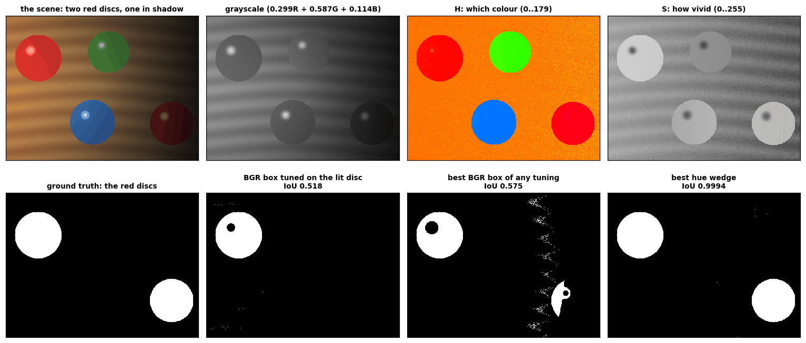

Panel 7 is the point: that is not a badly chosen threshold, it is the best
axis-aligned box in BGR that exists for this image, and it is spraying false
positives across the lit wood while still missing part of the shadowed disc.

**The honest caveat**, which the example prints itself: 0.9994 is higher than
any real photograph would give. This is a synthetic scene, the discs have
exactly one reflectance, and the only thing changing across the frame is the
light -- precisely the case hue is invariant to. What transfers is the ranking
and its mechanism.

---

## Stage 5 — convolution from scratch

`examples/05_convolution.py`

The operation: lay a small grid of numbers on a patch of pixels, multiply
element by element, add up the products, write the sum to the output, slide
one pixel, repeat.

Start with the version where the bookkeeping is visible:

```python
for i in range(out_h):
    for j in range(out_w):
        r, c = i * stride, j * stride   # output cell -> top-left of its patch
        patch = padded[r:r + kh, c:c + kh]
        out[i, j] = float((patch * k).sum())
```

Two details in those four lines are where whiteboard attempts die.
`r:r + kh`, never `r:r + kh - 1` -- Python's stop is exclusive, so `r:r+kh` is
exactly `kh` rows. And `H, W` are captured **before** padding, so the `+2p` in
the size formula is not double-counted.

```
    a dark left half, a bright right half, and Sobel-x, valid padding:
    [[210. 210.]
     [280. 280.]]
```

That is the drill everyone does on paper, and the bottom row is larger because
those windows sit entirely on the step while the top row averages in a flat row
that contributes 0.

The size formula, `floor((in + 2p - k)/s) + 1`, checked against the array it
predicts:

```
      in   k   p   s |  formula | actual
     224   3   1   1 |      224 | (224, 224)
     224   3   1   2 |      112 | (112, 112)
       4   3   0   1 |        2 | (2, 2)
      32   5   2   2 |       16 | (16, 16)
```

### The vectorised version, and why the loop is slow

```python
windows = np.lib.stride_tricks.sliding_window_view(padded, (kh, kh))
return np.tensordot(windows, k, axes=((2, 3), (0, 1)))
```

```
    on this 240x320 image: loops   231.7 ms, vectorised   2.07 ms  (112x)
```

The multiplies are identical. What the loop costs is 76,800 trips round the
interpreter to schedule nine of them at a time. This matters beyond speed: it
is the standard misdiagnosis when something runs at 30 fps on a laptop and 3
fps on a target board, and the fix is not a bigger board.

### Three implementations, one answer

```
    kernel          loops vs vectorised    vectorised vs cv2
    box 3x3                   5.684e-14            5.684e-14
    laplacian                 0.000e+00            0.000e+00
    sharpen                   0.000e+00            0.000e+00
    emboss                    0.000e+00            0.000e+00
```

`tests/test_convolve.py` asserts this for eight kernels including three random
ones, at three strides, and for every border mode against its OpenCV
counterpart.

Note the flip:

```
    true convolution vs correlation, emboss: max |difference| = 986.0
    same comparison with the symmetric box kernel:               0.0e+00
```

That is why the flip bug is slippery: invisible on every symmetric kernel, and
it appears the day you test an asymmetric one.

### The border problem

```
    border         corner     edge   centre
    constant         44.4     66.7    100.0
    reflect101      100.0    100.0    100.0
    replicate       100.0    100.0    100.0
    reflect         100.0    100.0    100.0
    wrap            100.0    100.0    100.0
    cv2.blur        100.0    100.0    100.0
```

Every input pixel was 100. A blur cannot change an image with no variation, and
zero padding returns 44.4 at the corners. The arithmetic is not subtle: of the
nine cells in a corner window, four sit on the image and five sit on invented
black, so `(4*100 + 5*0)/9 = 44.4`. Along an edge six of the nine are real, and
`600/9 = 66.7`.

Symptom to memorise: a hand-rolled filter with a dark rim that the library
version does not have. Check the padding before anything else.

The name mapping is the bug-prone part, and it is in the source as a table:

| our name | `np.pad` mode | OpenCV | pattern |
|---|---|---|---|
| `constant` | `constant` | `BORDER_CONSTANT` | `0 0 0 \| a b c d \| 0 0 0` |
| `reflect101` | `reflect` | `BORDER_REFLECT_101` | `d c b \| a b c d \| c b a` |
| `reflect` | `symmetric` | `BORDER_REFLECT` | `c b a \| a b c d \| d c b` |
| `replicate` | `edge` | `BORDER_REPLICATE` | `a a a \| a b c d \| d d d` |
| `wrap` | `wrap` | *(refused by `filter2D`)* | `b c d \| a b c d \| a b c` |

`np.pad`'s `reflect` is OpenCV's `REFLECT_101` and `np.pad`'s `symmetric` is
OpenCV's `REFLECT`. Swap them and your filter disagrees with the library only
in the outermost row and column, which reads as a rounding problem.

### The kernel sum is the brightness knob

```
    kernel         sum   out mean   out min   out max
    (original)       -     128.75      40.0     250.0
    box 3x3          1     128.75      40.0     250.0
    laplacian        0       0.00    -333.0     297.0
    sharpen          1     128.75    -235.0     547.0
```

Weights summing to 1 leave the mean untouched, and the result still reads as a
photograph. Weights summing to 0 pull the mean to zero, and the result is a map
of differences on black. The Laplacian and the sharpen differ by one unit of
centre weight -- 4 against 5 -- and that extra unit is a copy of the original
image added back in, which is the whole difference between an edge detector and
a sharpener.

And read the min and max columns again. Both leave `0..255` in both directions.
In `uint8` every negative clips to 0 and every overflow to 255, silently, and
what you lose is always the same half of your edges.

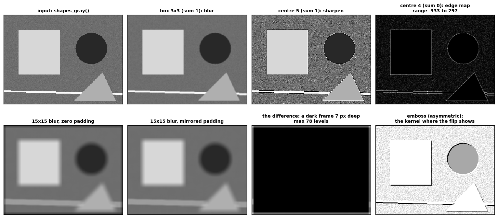

---

## Stage 6 — separable kernels

`examples/06_separable.py`

A 2-D kernel that is an outer product of two vectors can be applied as two 1-D
passes, for `2K` multiplies per pixel instead of `K*K`. The test for whether it
is: matrix rank 1.

```
    3x3 box        rank 1  ->  separable: True
      col [-0.192 -0.192 -0.192]  x  row [-0.577 -0.577 -0.577]
    Sobel-x        rank 1  ->  separable: True
      col [-1.414 -2.828 -1.414]  x  row [ 0.707  0.    -0.707]
    5x5 Gaussian   rank 1  ->  separable: True
    Laplacian      rank 2  ->  separable: False
    emboss         rank 3  ->  separable: False
```

Sobel-x factors into `[1, 2, 1]` and `[-1, 0, 1]` with a shared scale and both
signs flipped -- SVD is free to negate both vectors at once, because the outer
product does not notice. So the `2` in Sobel's middle row is literally a
smoothing pass glued to a differencing pass, not a magic constant.

`separate()` raises rather than approximating:

```python
if not is_separable(k):
    raise ValueError(
        f"kernel has rank {int(np.linalg.matrix_rank(k))}, so no exact factorisation "
        "exists; two 1-D passes would compute a different filter")
```

Forcing a rank-2 kernel through its largest singular vector gives two passes
that compute a *different* filter, correctly, with no warning.

### The measurement

Both routes accumulate whole shifted copies of the image, so they differ only
in how many multiply-adds happen per pixel. Timing a Python loop against a
library call would measure interpreter overhead and report it as an algorithmic
win.

```
      k  mults 2D  mults sep  predicted   2D (ms)  sep (ms)  measured   max diff
      3         9          6       1.5x       4.0      4.56     0.88x    1.1e-13
      7        49         14       3.5x      18.0      6.90     2.61x    1.7e-13
     15       225         30       7.5x      95.5     12.45     7.67x    3.4e-13
     31       961         62      15.5x     423.5     20.12    21.05x    6.5e-13
     63      3969        126      31.5x    1951.7     45.11    43.26x    1.2e-12
```

*That table is one run. Repeating it on the same (shared, loaded) machine gives
`measured` values between 0.88x and 1.26x at k=3, and between 31x and 46x at
k=63, against a `max diff` column that does not move at all. Which columns are
facts and which are weather is the point of the paragraph below.*

Two claims, and they must not be blurred together.

**`max diff` is exact.** Separability is a factorisation, not an approximation.
Anything above floating-point dust in that column is a defect, and the usual
culprit is the two passes padding differently -- which is why
`correlate_shift_separable` pads each pass only along the axis that pass travels,
instead of padding both axes once at the start.

**`measured` is a wall-clock timing on one shared CPU and it wobbles.** At
`k = 3` it lands either side of 1, because dropping 9 multiplies to 6 is swamped
by the fixed cost of each whole-array operation. From `k = 7` the saving is real, and
by `k = 63` it *overtakes* the prediction -- the 2-D pass also touches `K^2`
times as much memory, and at large `K` the cache, not the multiplier, is the
bottleneck. The claim that survives re-running this on another machine is "same
order, growing with K".

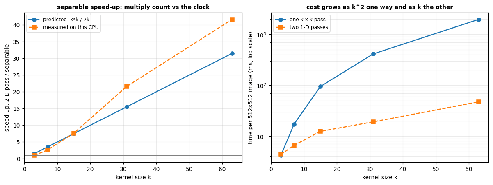

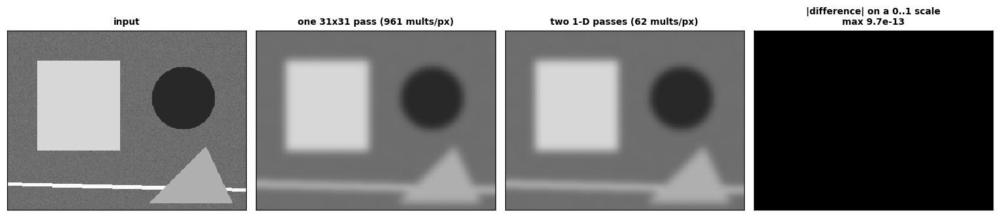

The right-hand panel of that second figure is drawn on a fixed 0..1 grey scale,
so it is black: the two results differ by about 1e-13, which is float64 addition
order and nothing else. Autoscale that panel instead and matplotlib will stretch
the dust across the full black-to-white range and hand you a convincing picture
of a difference that is not there -- which is why `figures.show_gray` pins
`vmin` and `vmax` by default.

This is why `cv2.GaussianBlur` stays affordable at large sigma: it never runs a
2-D pass.

---

## Stage 7 — derivatives, and a Canny of our own

`examples/07_edges.py`

Wherever brightness changes quickly there is an edge, so an edge detector is a
derivative, and a derivative on a grid is a convolution. The simplest derivative kernel is `[-1, 0, +1]` -- right
neighbour minus left neighbour. Sobel adds smoothing in the perpendicular
direction so one noisy pixel cannot own the answer.

```
    Gx = 210   Gy = 70
    magnitude (L2)     = 221.36
    gradient direction = 18.43 deg  (across the edge)
    edge orientation   = 108.43 deg  (along the edge)
```

`Gy` is 70, not zero. What makes that patch "a vertical edge" is `Gx`
*dominating* `Gy`, not `Gy` vanishing -- which on a real image it almost never
does.

Our Sobel is bit-identical to OpenCV's, because `correlate2d` defaults to the
same `BORDER_REFLECT_101`:

```
    max |difference|: Gx 0.0e+00, Gy 0.0e+00
```

### The distinction that makes NMS work

```
    test image            |Gx|    |Gy|   gradient  edge line
    vertical edge        270.0     0.0       0.0       90.0
    horizontal edge        0.0   270.0      90.0        0.0
    diagonal edge        184.1   184.1      45.0      135.0
```

**A large `Gx` puts the gradient arrow along the horizontal and the edge line
along the vertical.** Two separate statements about one pixel, and you need
both. The arrow is at right angles to the line: measuring the height of a fence
means walking into it, not along it.

### Non-maximum suppression

```
    image row       : [ 10  10  40  90 140 150 150]
    magnitude row   : [  0 120 320 400 240  40   0]
```

One soft edge, five pixels of ridge. NMS steps to the two neighbours **along
the gradient** -- which is *across* the edge -- and keeps the pixel only when it beats
both of them:

```
    compare ACROSS the edge (correct): [  0   0   0 400   0   0   0]  -> 3 pixels kept
    compare ALONG  the edge (bug)    : [0 0 0 0 0 0 0]  -> 0 pixels kept
```

Every row of that image is identical, so along the edge every pixel ties with
its neighbours, nothing is ever strictly largest, and the map comes back
**empty** -- no exception, no warning. Stepping along the ridge does not narrow
it. It wipes it out.

The tie-break is the `>=` on one side and `>` on the other:

```python
keep |= (bins[core] == b) & (centre >= fwd) & (centre > bwd)
```

Two adjacent pixels of exactly equal magnitude cannot both be crests. This rule
keeps the first and is what reproduces OpenCV's choice; flipping the two gives
an equally valid Canny whose lines sit one pixel over.

### Hysteresis

```
    thinned magnitudes : [  0   0 160  90  80  70   0  60   0]
    single threshold at 150: [0 0 1 0 0 0 0 0 0]  -> the edge broke into a dot
    single threshold at  50: [0 0 1 1 1 1 0 1 0]  -> the speck at index 7 got in
    hysteresis 50/150      : [0 0 1 1 1 1 0 0 0]  -> the whole edge, and only the edge
```

A high bar to *begin* an edge and a low one to keep following it. That is the
entire answer to "why two thresholds".

### The comparison

```
    image                     ours     cv2  differ  agreement
    shapes                    1618    1612      14    99.982%
    shapes, pre-blurred       1591    1580      19    99.975%
    checkerboard              3234    3164     126    99.781%
    diagonal ramp              297     299       2    99.992%
    pure noise                9245    9491     444    98.266%
```

The remaining pixels are a lesson, not a defect. OpenCV computes magnitudes in
16-bit integers and we computed them in float64, so wherever two neighbouring
magnitudes are exactly equal the two implementations break the tie differently
and the crest lands one pixel over. Both answers are correct, because a ridge
that is genuinely flat has no single crest.

Read the ordering: the **single smooth diagonal** is best (99.992%) -- one
unambiguous ridge, no ties. **Pure noise** is worst (98.27%) -- nearly every
pair of neighbours is a near-tie. The **checkerboard** sits between them despite
having the sharpest edges in the set, because its right-angle corners are
exactly where the four direction bins are ambiguous.

### The stage OpenCV leaves to you

```
    the scene has about 1580 real edge pixels

    noise sigma  no pre-blur  pre-blurred   excess
              0         1612         1580     1.0x
              5         1892         1588     1.2x
             10        12988         1589     8.2x
             20        26854         1585    16.9x
             30        27910         1600    17.4x
```

Below sigma 10 the blur changes essentially nothing, which is exactly why a
clean synthetic frame hides this lesson completely. At sigma 20 -- ordinary
sensor noise on a real camera -- leaving it out multiplies the edge count by 17,
and roughly 25,000 of those 26,854 pixels are grain.

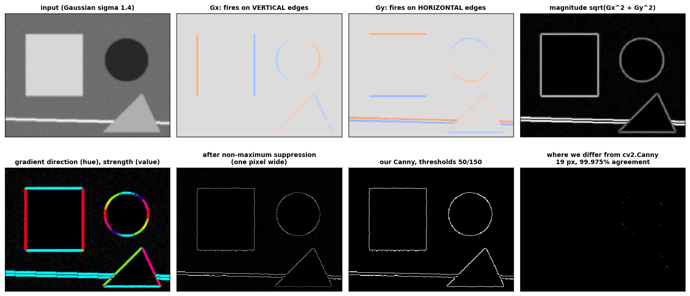

The last panel is the honest one. It is not blank and it is not supposed to be:
it is every pixel where two defensible implementations of the same algorithm
disagreed about which of two equal neighbours was the crest.

---

## Stage 8 — thresholding

`examples/08_thresholding.py`

Every stage so far produced another grayscale image. This is where a decision
gets made.

### Otsu, by hand and then in code

Twenty pixels, four distinct values, two humps and a wide valley:

```
    the crop:
    [[ 40  40  40  40  50]
     [ 50  50  50  50  50]
     [190 190 190 190 190]
     [190 200 200 200 200]]

    histogram: 40x4  50x6  190x6  200x4
```

Otsu scores every candidate threshold by the spread *inside* the two classes it
creates, weighted by their sizes:

```
        T   within-class   between-class       sum
       40        3900.00         1600.00   5500.00
       50          24.00         5476.00   5500.00
      190        3900.00         1600.00   5500.00
                          image variance   5500.00
```

The three rows sum to the same total, and that total is fixed by the image
alone -- no choice of `T` moves it. Pushing the within-class spread down and
pulling the between-class separation up are therefore the same operation seen
from two sides. Production code computes the between-class form, because
running sums of the histogram are all it needs:

```python
n0 = np.cumsum(hist)               # pixels with value <= t
s0 = np.cumsum(hist * levels)      # their summed value
...
curve = w0 * w1 * (mu0 - mu1) ** 2
```

`tests/test_threshold.py` checks that identity at 37 thresholds on 8 images.

The tie-break is not pedantry:

```
    the maximum is achieved for EVERY T from 50 to 189,
    because there are no pixel values in between
    ours returns 50 (argmax takes the first), cv2 returns 50.
```

A wide empty valley is the defining feature of the histograms Otsu handles
well, so a tie-break that differs from OpenCV's would disagree on very nearly
every image the method is intended for. The test asserts equality on eight images including a ramp, a
checkerboard, flat noise and a lit page.

### Where a single number cannot win

```
    leftmost 50 columns mean  173.5   rightmost 50 columns mean   51.2
    true ink coverage: 18.4% overall, 19.2% left half, 17.5% right half

    method              IoU  ink found, left  ink found, right
    global T=127      0.307            21.2%             98.4%
    otsu T=109        0.351            19.2%             85.3%
    adaptive 31/10    0.958            20.8%             17.6%
    (truth)           1.000            19.2%             17.5%
```

The truth is about 18% ink in the right half, and the global threshold claims
98%. The shadowed paper has fallen below 127, so as far as one fixed number is
concerned the whole right-hand side of the sheet is writing. Otsu improves on
that and is still wrong, for the same structural reason: it also has only one
number to spend on the entire frame.

Adaptive thresholding asks a different question -- "is this pixel darker than
its own neighbourhood?" -- and a shadow moves a pixel and its neighbourhood
together. The local mean is a box blur, and a box blur is separable, so stage 6
pays for stage 8:

```python
ones = np.ones(block_size, np.float64) / block_size
local_mean = correlate_shift_separable(gray.astype(np.float64), ones, ones,
                                       border="replicate")
```

```
    agreement: 99.8937% of pixels (102 differ)
```

Not 100%, and the reason is worth knowing: OpenCV computes the local mean in
integer arithmetic and rounds, we accumulated in float64. The pixels that differ
are the ones sitting within half a level of their own local mean, which is
exactly the set where the answer was a coin toss.

### Two ways Otsu lies

```
    unimodal noise, no valley at all -> Otsu returns T = 127, and 50.4% of the
    image comes back foreground.
```

No implementation anywhere reports "your histogram has only one hump", and none
ever will. The affordable guard is `foreground_fraction`: near 0.5 when you expected a small object
means the threshold is meaningless.

```
      Otsu on the noisy image      -> T=107, 438 wrong pixels of 40,000
      one GaussianBlur, then Otsu  -> T=103, 13 wrong pixels
```

The blur belongs upstream of Otsu. Otsu only ever looks at the histogram, and
noise fattens both humps until they run into each other; tidying the mask
afterwards arrives too late, because the misclassified pixels are already
decided.

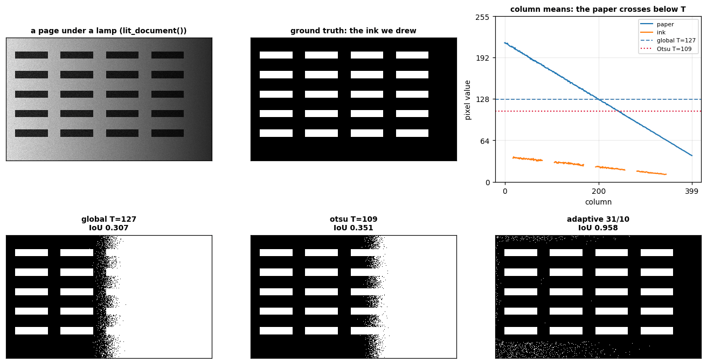

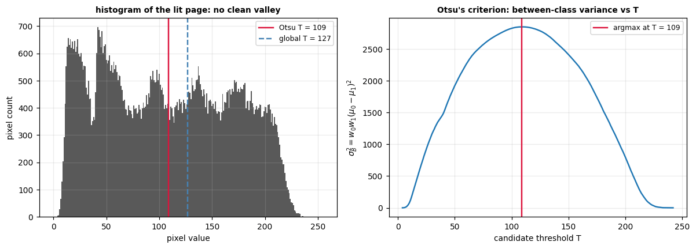

The right-hand plot is Otsu in one picture: a single smooth curve over 256
candidates, and the threshold is wherever it peaks. The left-hand plot is why
that peak is not good enough here -- the lamp has smeared the paper across the
whole range, so there is no valley to find.

---

## Where this leads

Every stage above is arithmetic on an array, and the array has not changed
since stage 1. Convolution is the sliding window; a Gaussian blur, a Sobel
gradient and a learned CNN filter are the same sliding window with different
numbers in it. The mask that comes out of stage 8 is what a connected-components
pass turns into a list of objects, which is the next thing to build.

The two bugs from stage 2 do not go away either. They are waiting in every
pipeline that normalises an image before a network, crops a region of interest,
or blends two frames.
